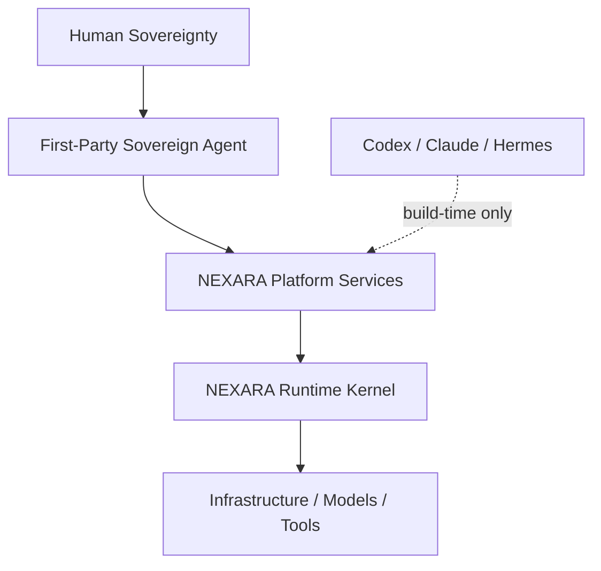
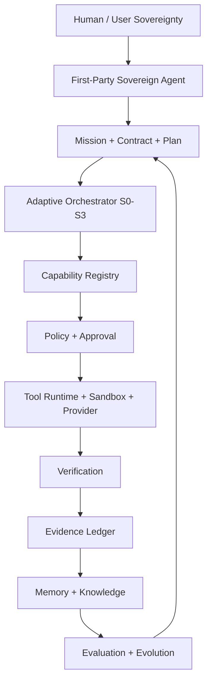

# NEXARA PRIME 第一方主权智能体：总体架构蓝图与完整项目开发书 V1.0

**内部代号**：NEXARA Sovereign Agent（正式产品名：**柏韩 Bǎi Hán**，已于 2026-07-23 品牌 Gate 决定）

**平台**：NEXARA PRIME  |  **第一方 Agent 包**：`nexara_prime.agent`  |  **Hermes 运行依赖**：0

**文档目的**：用一份长期有效的唯一事实源，替代“每一步复制粘贴、每一步重新问方案”的工作方式。

## 执行结论

最优路线不是给 Hermes 换名字，也不是完全从零重建，更不是先做一个庞大的多智能体市场。最优且可行的路线是：**保留并冻结已经验证的 NEXARA PRIME Runtime Kernel，在其上建立完全第一方的 Agent Domain 和 Platform Runtime Services，再形成三端产品、SDK 与受控演化闭环。**

这条路线在 8 项加权指标中得到 **9.45/10**，显著高于换壳方案 5.15、从零重建 6.05、先做生态 6.60。

## 0. 文档如何使用

本文件是产品、架构、工程、设计、治理和验收的母文档。Codex、Claude、Hermes 或未来其他执行器只能作为构建工具，必须读取本文件及配套 Constitution/Gates 文件后执行，不得把自身框架、身份或默认工作流写入产品运行链。

后续不再以“今天做什么、明天做什么”推进，而采用 Gate DAG：每个 Gate 有输入、输出、验收、回滚和阻断条件；执行器自动选择下一个已解锁 Gate，只有遇到真实审批、不可恢复阻断或产品决策才回到用户。

## 1. 产品定义

### 1.1 一句话定位

**一个由我们完全拥有、以人类意图为最高主权、能够持续理解目标、规划、执行、验证、恢复、记忆并受控演化的本地优先第一方智能体。**

### 1.2 产品不是

- 不是 Hermes、Claude、Codex 或任何外部 Agent Framework 的换壳。
- 不是聊天机器人 UI。
- 不是固定 8 个角色的表演系统。
- 不是只会规划、不执行、不验证的“方案生成器”。
- 不是允许模型绕过人类审批的自动化脚本。

### 1.3 产品基本单位

产品的基本单位不是 Message 或 Prompt，而是：`Mission → Work Contract → Plan → Capability → Policy → Execution → Verification → Evidence → Memory → Evolution`。

### 1.4 产品边界

| 层 | 职责 | 所有权 |

| --- | --- | --- |

| 第一方主智能体 | 身份、目标、决策、Mission、长期记忆、演化轨迹 | 完全自有 |

| NEXARA PRIME Platform | Capability、Policy、Knowledge、Telemetry、Identity、Evidence 服务 | 完全自有 |

| NEXARA PRIME Kernel | 调度、沙箱、Provider、Recovery、Event Bus、持久化 | 完全自有 |

| DeepSeek/GPT/Claude/本地模型 | 可替换推理资源 | 外部供应商，不拥有 Agent 身份 |

| Codex/Claude/Hermes | 开发期执行工具 | 不进入产品运行依赖 |


## 2. 多轮推演与战略选择

### 2.1 评价方法

采用 8 项加权决策模型。每项 1-10 分，最终分 = Σ(权重 × 分值) / 100。权重优先保护长期主权、现有资产复用、可靠性和治理，而不是只追求短期开发速度。

| 指标 | 权重 |

| --- | --- |

| 主权与知识产权 | 20% |

| 复用现有 NEXARA 资产 | 15% |

| 可交付速度 | 12% |

| 运行可靠性 | 15% |

| 治理与审计 | 12% |

| 长期扩展性 | 12% |

| 成本效率 | 8% |

| 产品差异化 | 6% |


| 方案 | 主权与知识产权 | 复用现有 NEXARA 资产 | 可交付速度 | 运行可靠性 | 治理与审计 | 长期扩展性 | 成本效率 | 产品差异化 | 加权总分 |

| --- | --- | --- | --- | --- | --- | --- | --- | --- | --- |

| A. Hermes 换壳/二次封装 | 3 | 5 | 9 | 6 | 5 | 4 | 7 | 3 | 5.15 |

| B. 完全从零重建 | 10 | 2 | 3 | 5 | 7 | 9 | 3 | 8 | 6.05 |

| C. 在 NEXARA PRIME 上构建第一方主智能体 | 10 | 10 | 8 | 9 | 10 | 10 | 8 | 10 | 9.45 |

| D. 先做多智能体生态/市场 | 8 | 7 | 4 | 5 | 6 | 10 | 4 | 8 | 6.60 |


### 2.2 推演结论

方案 C 同时满足主权、复用、治理和扩展性。方案 A 的短期速度最高，但把产品命运绑定在外部 Agent；方案 B 主权高但浪费已验证内核并显著增加回归风险；方案 D 顺序错误，在第一方 Agent 尚未成立前先做生态会放大不稳定接口。

## 3. 当前基线与真实缺口

基线依据当前终端证据：NEXARA PRIME 已有 415/415 测试通过、DeepSeek macOS Keychain 严格路径、Adaptive Runtime、Evidence/Audit/Recovery，以及 Platform P1 的 21 个 inventory/manifest/report 文件。当前最大缺口不是 Kernel，而是“第一方 Agent Domain”和“可运行 Platform Services”。

| 域 | 权重 | 成熟度 | 判断 |

| --- | --- | --- | --- |

| Runtime Kernel | 20 | 4.3/5 | 已完成 Mission、状态机、Adaptive Runtime、Provider、恢复与测试基线 |

| 治理与安全 | 15 | 4.2/5 | Policy、Approval、Sandbox、Audit、Keychain 与 fail-closed 已验证 |

| Evidence / Memory / Recovery | 15 | 3.8/5 | 基础能力较强，尚缺第一方智能体语义与统一知识闭环 |

| Platform Services | 15 | 1.8/5 | P1 主要是 manifest/schema/inventory，运行服务尚未全部落地 |

| 第一方 Agent Domain | 15 | 0.5/5 | 身份、人格、Mission 主权、长期记忆命名空间尚未形成 |

| 产品体验 | 7 | 1.0/5 | 已有设计资产，但第一方智能体三端产品尚未成为真实 Runtime 表面 |

| SDK / Plugin / Ecosystem | 3 | 0.5/5 | 仍处于规划和骨架阶段 |

| Provider / SecretStore | 10 | 4.1/5 | DeepSeek Keychain 生产路径与严格模式已验证 |


按权重计算的系统成熟度约为 **2.9/5（58%）**。这不代表项目只完成 58%，而是说明底层 Kernel 很成熟，但面向用户的第一方 Agent 与平台服务尚未形成。继续只写 manifest、YAML 和文档会产生“平台看起来存在、运行时却没有真正使用”的错觉。

## 4. 产品宪章

1. **人类主权**：目标、批准、最终责任和可撤销权属于用户。
2. **第一方身份**：agent_id、产品人格、原则、记忆命名空间和演化历史由我们拥有。
3. **模型独立**：模型只承担推理，不拥有任务、权限、记忆或产品身份。
4. **Runtime Truth**：UI 只显示权威状态；mock、dry-run、live 必须明确区分。
5. **Evidence before Completion**：没有 E1/E2 证据不得显示完成。
6. **Single Writer**：任何可变更工程/外部系统只允许一个持有 Writer Lease 的执行者写入。
7. **Policy before Capability**：能力可用不等于有权限执行。
8. **Evolution by Experiment**：演化必须有证据、模拟、Benchmark、审批和回滚。
9. **Local-first**：默认本地持久化、Keychain、SQLite/DuckDB，可迁移但不依赖云。
10. **Hermes dependency = 0**：产品运行、测试、打包和用户体验不要求 Hermes 存在。

## 5. 总体系统架构



产品栈从上到下明确分离“谁拥有意图”“谁做决策”“谁提供平台服务”“谁执行动作”“谁提供外部能力”。任何外部模型或执行器都不可跨层获得永久主权。

## 6. 十二层架构 L01-L12

| 层 | 名称 | 责任 | 核心对象 |

| --- | --- | --- | --- |

| L01 | Intent / 意图 | 把自然语言目标编译为结构化 Mission；维护目标、优先级、期限、成功定义。 | IntentRecord、GoalGraph |

| L02 | Context / 上下文 | 构建世界状态：项目、文件、人员、资源、约束、历史与实时信号。 | ContextSnapshot、WorldState |

| L03 | Contract / 合约 | 将目标变成可审计工作合约；固定输入、输出、边界、预算、审批与回滚。 | WorkContract |

| L04 | Planning / 规划 | 生成 Task DAG、依赖、并行组、检查点、候选路径与资源计划。 | Plan、TaskGraph |

| L05 | Reasoning / 推理 | 模型路由、假设、比较、反事实、风险与成本评估；不直接拥有执行权。 | DecisionRecord |

| L06 | Capabilities / 能力与工具 | 把模型、工具、技能、连接器、工作流统一成可治理 Capability。 | CapabilityManifest、CapabilityScore |

| L07 | Execution / 执行 | 单写者、沙箱、幂等、租约、工具调用与外部副作用控制。 | ExecutionRun、ToolCall |

| L08 | Verification / 验证 | 测试、断言、回归、对照、验收、人工复核和结果置信度。 | VerificationReport |

| L09 | Evidence / 证据 | 不可抵赖执行回执、来源、哈希、审批、输入输出与审计链。 | EvidenceEnvelope、Receipt |

| L10 | Memory / 记忆 | 将证据固化为事件、语义、程序、偏好和项目记忆；支持冲突与遗忘。 | MemoryItem、MemoryPatch |

| L11 | Governance / 治理 | R0-R4 风险、策略、审批、身份、授权、秘密、合规和人工主权。 | PolicyDecision、Approval |

| L12 | Evolution / 演化 | 基于评测数据生成改进候选，先模拟和 Benchmark，再审批升级并可回滚。 | ImprovementProposal、Experiment |


十二层不是 UI 装饰节点，而是运行时责任边界。每一个 Mission 的关键事件必须能映射到至少一层，并能被 trace_id 贯穿。L11 治理是横向门控，L12 演化不能绕过 L11。

## 7. 第一方 Agent Domain

| 服务 | 职责 |

| --- | --- |

| Agent Identity Service | 第一方 agent_id、产品身份、原则、能力画像、权限模板、记忆命名空间；与模型彻底解耦。 |

| Mission Service | Mission 创建、持续状态、目标树、优先级、阻断、暂停、继续、取消、完成与回放。 |

| Context / World Model Service | 把 Git、文件、知识、日历、连接器和运行时信号组织成版本化 WorldState。 |

| Contract Service | 编译 WorkContract，固定范围、验收、预算、风险、授权和 rollback plan。 |

| Planning & Simulation Service | Task DAG、多路径模拟、资源分配、风险/成本预测、计划修订。 |

| Orchestration Service | S0-S3 自适应模式、动态专家角色、Writer Lease、并行/串行调度、升级降级。 |

| Capability Registry Service | 注册、发现、健康、依赖、版本、权限、评分、加载、卸载与隔离。 |

| Policy & Approval Service | deny-by-default、R0-R4、审批绑定、授权范围、可解释策略决策。 |

| Execution Service | Tool Runtime、Sandbox、Provider Gateway、幂等、checkpoint、recovery、rollback。 |

| Verification Service | 自动测试、对照、事实核验、结果评分、验收和人工复核。 |

| Evidence & Audit Service | Evidence Ledger、hash chain、trace、receipt、source、审批与变更证据。 |

| Memory & Knowledge Service | 证据支持的 Memory Graph、项目知识、检索、冲突消解与保留策略。 |

| Evaluation & Evolution Service | 任务质量、成本、延迟、失败模式、候选优化、实验和受控升级。 |

| Telemetry Service | Mission/Task/Provider/Token/Cost/Approval/Failure/Recovery 全链路观测。 |


### 7.1 推荐代码边界

```text
src/nexara_prime/agent/
  identity.py
  mission.py
  context.py
  contract.py
  planner.py
  simulator.py
  reasoner.py
  orchestrator.py
  scheduler.py
  capability_resolver.py
  decision_record.py
  verification.py
  recovery.py
  memory.py
  evaluation.py
  evolution.py
```

这些模块只能通过明确的 Platform Service 接口调用 Kernel，不允许直接依赖 Hermes、外部 Agent SDK 或开发工具的会话状态。

## 8. Mission 生命周期与状态机

| 状态 | 定义 |

| --- | --- |

| DRAFT | 接收但尚未形成结构化目标 |

| CONTEXT_READY | 关键上下文已满足最小充分条件 |

| CONTRACTED | WorkContract 已生成并校验 |

| PLANNED | Task DAG 与验收点已生成 |

| SIMULATED | 完成风险、成本、权限和候选路径模拟 |

| APPROVAL_REQUIRED | 存在需要人类批准的动作 |

| READY | 无阻断且可执行 |

| RUNNING | 正在持有 Writer Lease 或执行只读工作 |

| VERIFYING | 正在执行测试、事实核验和验收 |

| COMPLETED | 验收条件全部满足并有证据 |

| PAUSED | 人工暂停，状态可恢复 |

| BLOCKED | 缺输入、权限、凭据或依赖 |

| FAILED | 不可自动恢复的失败 |

| ROLLING_BACK | 执行补偿/恢复 |

| ROLLED_BACK | 已恢复到安全状态 |

| CANCELLED | 由用户取消且产生终止回执 |


任何状态转换都必须由事件驱动并满足前置条件。`COMPLETED` 不是“模型说完成”，而是 Acceptance Criteria 已满足、Verification 通过且 Evidence 等级达到要求。

## 9. 核心对象模型

| 对象 | 最小字段 |

| --- | --- |

| AgentIdentity | agent_id, display_name, product_principles, capability_profile, permission_profile, memory_namespace, version |

| Mission | mission_id, owner_id, goal, priority, state, risk, contract_id, plan_id, budget, timestamps |

| WorkContract | inputs, outputs, constraints, acceptance_criteria, allowed_side_effects, approvals, rollback_plan |

| Plan | tasks, dependencies, parallel_groups, checkpoints, estimated_cost, estimated_risk, alternatives |

| Task | task_id, capability_requirements, state, writer_lease, inputs, outputs, retry_policy, verification_spec |

| Capability | capability_id, version, owner, risk, permissions, schemas, dependencies, health, score |

| PolicyDecision | decision_id, subject, action, resource, context, result, reason_codes, required_approvals |

| ExecutionRun | run_id, task_id, provider, model, tool_calls, checkpoints, status, idempotency_key |

| EvidenceEnvelope | evidence_id, source, claim, artifact_ref, hash, confidence, approval_ref, trace_id |

| MemoryItem | memory_id, kind, content, provenance, confidence, validity, conflicts, retention |

| ImprovementProposal | proposal_id, target, evidence, hypothesis, expected_gain, risk, experiment_plan, rollback |


所有对象必须有：稳定 ID、schema_version、created_at/updated_at、owner/actor、trace_id 或关联关系。跨 Gate 的 schema 变更必须通过 migration 和 backward-compat test。

## 10. 事件与数据平面

权威状态采用事件驱动：UI/API 发出 Command，Domain 产生 Event，Projector 更新查询模型；Evidence、Memory、Telemetry 都从事件流订阅，不允许各自构造冲突事实。

核心事件族：`mission.*`、`contract.*`、`plan.*`、`approval.*`、`capability.*`、`execution.*`、`verification.*`、`evidence.*`、`memory.*`、`policy.*`、`recovery.*`、`evolution.*`。

建议持久化：SQLite WAL 作为权威事务库；JSONL/hash-chain 作为审计导出；DuckDB 作为分析投影；NetworkX/图数据库接口作为 Memory/Knowledge 图投影。

## 11. Capability Runtime

Capability 统一模型、工具、技能、连接器和工作流。Registry 必须提供 `register / resolve / health / dependency / version / permission / score / load / unload / quarantine`。

CapabilityScore 建议由五个维度组成：能力匹配 30%、历史成功率 25%、风险适配 20%、成本/Token 15%、延迟 10%。评分不是永久常量，而由 Evaluation Service 基于证据更新。

工具执行契约必须包含输入/输出 schema、risk_level、side_effect_class、idempotency、rollback、timeout、network policy、secret scope 和 verification hook。

## 12. 自适应多角色调度

| 模式 | 适用 | 调度策略 |

| --- | --- | --- |

| S0 Instant | 简单、低风险、单步 | 主智能体独立完成；0-1 专家；严格 token 上限 |

| S1 Assisted | 中等复杂度、少量依赖 | 主智能体 + 1 专家；一次计划修订 |

| S2 Managed | 复杂项目、多模块 | 主智能体 + 3-4 专家；并行组、Reviewer、Evidence |

| S3 Governed | 高风险/跨系统/长期任务 | 主智能体 + 5-8 专家；Simulation、Approval、Auditor、Recovery |


角色不是固定人格，而是 Mission 期间生成的能力配置。建议角色模板：系统架构、产品设计、工程执行、代码审查、安全审计、质量验证、知识管理、演化评估。简单任务不得强制启动全队。

参考当前 benchmark：简单任务 3.0 对比固定 8.0，减少 62.5%；整体平均 4.6 对比 8.0，减少 42.5%。这两个口径必须分开，不能把 simple-task 指标当作整体指标。

## 13. 模型路由与 Token 经济学

模型路由是 Platform Service，不写入 Agent Identity。路由输入包括任务类型、风险、上下文长度、工具需求、历史成功率、预算和隐私。

推荐三级策略：
- Fast：分类、抽取、格式化、短计划，优先低成本模型。
- Reasoning：复杂规划、评审、反事实，按证据提升到高能力模型。
- Local/Private：敏感内容、离线任务、可接受较低能力时使用本地模型。

Token Compiler 把长提示编译为短指令 + 对象引用 + Skill/Capability 引用；上下文按 Mission/Task 分片，只给执行角色最小充分上下文。成本预算由 WorkContract 固定，超过阈值需重规划或审批。

## 14. 治理、安全与证据

| 风险 | 含义 | 默认策略 |

| --- | --- | --- |

| R0 | 纯读取/推理 | 自动执行；记录 trace |

| R1 | 可回滚本地修改 | 自动或轻提示；必须有 diff 与验证 |

| R2 | 显著本地变更/敏感读取 | 明确审批或预授权；Writer Lease |

| R3 | 外部副作用/生产变更 | 逐项审批；强证据；可回滚/补偿 |

| R4 | 高影响、不可逆、金钱/身份/安全 | 双重确认或禁止；默认 fail-closed |


| 证据级别 | 含义 | 用途 |

| --- | --- | --- |

| E0 | 声明 | 模型或工具声称发生；不得作为“完成”依据 |

| E1 | 可复核证据 | 日志、diff、截图、测试结果、响应摘要，可由人或系统复核 |

| E2 | 强证据 | 哈希、签名、不可变链、外部回执、重复验证或独立验证器 |


强制边界：secret 不进入 Prompt、日志、Evidence、Git 或报告；R3/R4 外部副作用必须审批绑定；delete/sudo/payment/external-send/production deploy 默认禁止或逐项审批；审批必须绑定具体 action、resource、diff、有效期和 idempotency key。

## 15. Memory & Knowledge

记忆不等于聊天历史。采用五类最小模型：Episodic（发生过什么）、Semantic（已验证事实）、Procedural（如何做）、Preference（用户偏好）、Governance（授权/禁止/政策）。

长期记忆写入规则：只有带 provenance、confidence、validity、evidence_refs 的内容可晋升；冲突事实并存并标记，不允许静默覆盖；过期和低置信度信息按 retention policy 降级。

Obsidian 继续作为人类理解和架构决策层，不承担 Runtime Truth、审批权限、原始 Evidence 或事务数据库。Knowledge Fabric = Obsidian + Git + Runtime Truth + Evidence Ledger。

## 16. Evaluation & Evolution

演化循环：Observe → Diagnose → Candidate → Simulation → Benchmark → Approval → Deploy → Monitor → Rollback。

禁止模型直接修改自身权限、审批规则、secret scope 或安全边界。所有自改只能形成 ImprovementProposal；高风险候选必须由独立 Reviewer/Auditor 验证。

评测集合至少覆盖：任务成功率、事实正确性、工具调用正确性、审批合规、恢复、重复副作用、Token/成本、延迟、用户接管、长期记忆污染和 UI Runtime Truth。

## 17. Observability 与目标 SLO

| 指标 | 目标 |

| --- | --- |

| Mission 完成真实性 | 100% 完成状态必须绑定 E1/E2；无证据不得显示 Completed |

| 审批绕过 | 目标 0；所有 R3/R4 动作必须有可验证审批绑定 |

| 重复外部副作用 | 目标 0；幂等键、回执、恢复测试覆盖 |

| 秘密泄露 | 目标 0；报告、日志、Git、Evidence、UI 全面扫描 |

| 恢复能力 | 可恢复失败的 checkpoint resume 成功率目标 ≥99%（内部测试口径） |

| 运行真相 | UI 状态 100% 来自权威状态存储，不允许 mock/live 混淆 |

| 简单任务资源效率 | S0/S1 平均 1-3 个执行角色；相对 8-agent 固定模式减少约 62.5% |

| 整体角色效率 | 当前 benchmark 参考：4.6 vs 8.0，整体平均减少 42.5% |

| 模型独立性 | 更换 provider 后 Agent Identity、Mission、Memory、Policy、Evidence 保持不变 |


Telemetry 记录 Mission/Task/Provider/Token/Cost/Latency/Approval/Failure/Recovery，但不得记录 secret 或模型私有思维过程。对用户展示决策摘要、理由码和证据，而不是隐藏链式思维。

## 18. 产品体验蓝图

| 核心表面 | 职责 |

| --- | --- |

| Mission Composer | 输入目标、补充约束、选择自主度；不是聊天框中心。 |

| Mission Workspace | 目标、合约、Task DAG、进度、阻断、预算、风险的统一工作台。 |

| Live Runtime | 实时步骤、能力、模型、工具、Writer Lease、checkpoint 与失败恢复。 |

| Approval Center | 审批对象、影响范围、diff、证据、rollback、授权时效和撤销。 |

| Evidence Ledger | 结果回执、来源、测试、diff、截图、哈希、置信度与审计链。 |

| Memory Graph | 事实、经验、偏好、项目知识、冲突、来源和演化记录。 |

| Capability Control | 能力、权限、健康、成本、成功率、依赖与禁用/隔离。 |

| Performance & Evolution | 成功率、失败热区、Token/成本、候选改进、实验与回滚。 |


三端必须独立设计：Mac 是专业工作台；iPad 是任务指挥与审阅；iPhone 是状态、审批、快速输入和紧急接管。禁止把桌面页面缩小成移动端。

视觉宪章：暖象牙白、雾灰、石墨黑、香槟金、玉石绿；高级、克制、真实阴影、系统级组件；禁止深蓝 AI 套路、廉价霓虹、机器人中心、科幻 HUD、debug label 和 mock/live 混淆。

运行中心围绕“用户当前激活的意图”，而不是某个 AI 名字。主智能体可以有品牌身份，但 UI 的最高层级始终是 Mission 和人类控制。

## 19. 开放与商业策略

建议采用 Open-Core，而不是把全部产品一次性开放：
- NEXARA PRIME Kernel：沿用当前 MIT，建立开发者信任和生态入口。
- 公共 SDK、Capability Manifest、基础插件协议：开放。
- 第一方主智能体品牌、默认策略包、高级 Evaluation、托管同步、团队治理与商业连接器：保留商业产品层。
- 用户数据、Memory、Evidence 默认本地归用户所有。

核心护城河不是某个模型，而是：长期 Mission 状态、证据支持记忆、治理策略、运行数据、能力评分、失败回归集、跨设备体验和受控演化。

## 20. API、SDK 与插件边界

API 以 Mission/Contract/Plan/Approval/Execution/Evidence/Memory/Capability 为资源，禁止以某模型或某执行器为中心。SDK 目标：Python、TypeScript、Swift、REST、MCP。

插件必须进程隔离或沙箱、声明权限、网络、secret scope、输入输出、风险、版本、签名和健康检查。插件声明能力不等于被授权执行。

## 21. 推荐仓库结构

```text
NEXARA-PRIME/
  src/nexara_prime/
    agent/                 # 第一方主智能体 Domain
    platform/              # 可运行 Services
      capability/ policy/ telemetry/ knowledge/ identity/ evidence/
    kernel/                # 已验证 Runtime Kernel
    governance/
    api/ cli/
  experience/
    macos/ ios/ web/
  sdk/
    python/ typescript/ swift/ mcp/
  plugins/
  contracts/               # schemas + API compatibility
  evals/                    # regression + benchmark
  docs/
    PRODUCT_CONSTITUTION.md
    ARCHITECTURE.md
    THREAT_MODEL.md
  .nexara/
    PROGRAM_STATE.json
    GATE_STATUS.json
```

## 22. 完整开发计划：Gate DAG，而不是日历

| Gate | 名称 | 工程单位 | 退出条件 |

| --- | --- | --- | --- |

| G0 | 产品宪章与边界冻结 | 60 | 唯一事实源、命名、主权、对象/事件/API 兼容基线、非目标 |

| G1 | 第一方 Agent Identity Domain | 100 | AgentIdentity、Profile、Memory Namespace、权限模板；Hermes runtime dependency=0 |

| G2 | Mission Agent 闭环 | 150 | Intent→Context→Contract→Plan→Execute→Verify→Evidence→Memory 全闭环 |

| G3 | Platform Runtime Services | 150 | Capability/Policy/Telemetry/Knowledge 服务从 YAML 变成可运行服务 |

| G4 | Capability & Tool Runtime | 120 | 统一能力注册、健康、依赖、沙箱、幂等、连接器与模型路由 |

| G5 | Memory & Knowledge Fabric | 110 | 证据支持记忆、Knowledge Graph、检索、冲突和保留策略 |

| G6 | Governance & Evidence Hardening | 100 | R0-R4、E0-E2、审批绑定、审计链、secret、rollback、red-team |

| G7 | 三端产品体验 | 160 | Mac/iPhone/iPad 独立布局；Runtime Truth；五模式；截图与可用性验收 |

| G8 | SDK / Plugin Boundary | 80 | Python/TypeScript/Swift/REST/MCP SDK，插件签名和隔离 |

| G9 | Evaluation & Evolution | 100 | Benchmark、失败回归、候选改进、模拟、审批升级、回滚 |

| G10 | RC 与发布闭环 | 70 | 版本冻结、打包、SBOM、发布说明、DMG、IPA 条件、运维手册 |


基础工作量合计 **1,200 工程单位**。基于现有 Kernel 与治理资产，预计可复用约 30%-35%，但集成、回归和三端体验需增加约 20%-25% 质量储备。最终规划预算建议按 **约 1,000-1,100 有效工程单位** 管理，而不是承诺不可靠的日历日期。

Gate 顺序是依赖图，不是绝对串行。G3 与 G5 可在 G2 核心对象冻结后并行；G7 必须在 Runtime Truth API 稳定后进行；G8 只能在 Capability/Policy 接口稳定后进行；G10 只能在所有阻断级验收关闭后进入。

## 23. 每个 Gate 的统一执行协议

每个 Gate 必须包含：Scope、Inputs、Non-goals、Architecture Decisions、Implementation Tasks、Tests、Evidence、Migration、Rollback、Security Review、UX Impact、Final Verdict。

状态只允许 `NOT_STARTED / RUNNING / PARTIAL / BLOCKED / PASS`。执行器不得通过降低断言、删除测试、修改报告文本或把 mock 说成 live 获得 PASS。

## 24. 自动执行工作方式：一次部署，持续推进

在仓库根目录保存 `NEXARA_PROGRAM_CONSTITUTION_V1.md` 和 `NEXARA_DEVELOPMENT_GATES_V1.yaml`。任何执行智能体启动时只需要一次性收到 Bootstrap 指令：读取这两个文件和 `.nexara/GATE_STATUS.json`，执行下一个无阻断 Gate，持续到需要真实人类审批或出现不可恢复阻断。

执行器每完成一个 Gate 自动：更新状态、运行测试、生成 Evidence、提交本地 commit、保持 worktree clean、选择下一 Gate。禁止 push/merge/tag/deploy，除非用户给出明确批准。这样用户不需要在每一个小步骤之间搬运 Prompt。

## 25. 测试与验收体系

测试金字塔：Schema/Unit → Service Contract → Integration → Mission E2E → Failure Injection → Security/Secret → UI Runtime Truth → Packaging/Install。

每次 Gate 至少产生：test summary、runtime truth snapshot、evidence manifest、secret scan、migration report、rollback rehearsal、final acceptance report。

V1 RC 的不可妥协条件：第一方 agent_id 与 memory namespace 存在；Hermes runtime dependency=0；真实 Mission 闭环；R3/R4 无审批绕过；E1/E2 完成证据；恢复无重复副作用；macOS 可安装；iOS 在 Provisioning Profile 具备后输出可验收 IPA。

## 26. 主要风险与控制

| 风险 | 表现 | 控制 |

| --- | --- | --- |

| 平台文档化而不运行 | 大量 YAML/报告，Runtime 仍直接 import 旧模块 | G3 强制实现 Service + API + integration test |

| 第一方 Agent 只是换名 | 身份或工具链仍来自 Hermes/外部框架 | dependency scan、启动测试、删除外部 runtime 假设 |

| 多角色过度使用 | 简单任务固定启动 8 个角色，成本和上下文膨胀 | S0-S3 triage、预算、角色上限与 benchmark |

| 记忆污染 | 模型声明直接进入长期记忆 | Evidence-backed promotion、置信度、冲突与过期机制 |

| 治理成为“绑手绑脚” | 低风险本地工作频繁审批 | R0/R1 自动、R2 预授权、只把 R3/R4 严格门控 |

| UI 成为展示板 | 漂亮但与 Runtime 无真实绑定 | Runtime Truth API、状态契约测试、截图与交互 QA |

| 自演化失控 | 自动修改权限、政策或产品主线 | Proposal-only、独立验证、审批、可回滚实验 |

| 开放源代码失去商业价值 | 全部能力和托管服务无差异开放 | Open-Core 分层、品牌/策略/托管/商业连接器保留 |


## 27. 最终最优路线

**冻结 NEXARA PRIME Kernel → 建立第一方 Agent Identity 与 Mission Domain → 将 Platform P1 从文档变成 Runtime Services → 跑通真实 Mission 闭环 → 建立 Evidence-backed Memory 和受控演化 → 设计三端 Runtime Truth 产品 → SDK/插件 → RC。**

任何后续新想法先进入 backlog 和 Architecture Decision Record，不插队破坏 Gate 主线。用户只在以下情况介入：产品命名与品牌决策、R3/R4 真实外部动作、不可恢复架构分歧、生产发布和商业授权。

## 附录 A：总架构 Mermaid



## 附录 B：决策记录模板

```yaml
adr_id: ADR-XXXX
title: ...
status: proposed|accepted|superseded|rejected
context: ...
decision: ...
alternatives: []
tradeoffs: []
security_impact: ...
data_impact: ...
compatibility: ...
rollback: ...
evidence_refs: []
```

## 附录 C：最终完成定义

项目完成不是代码写完，而是：真实用户能提交长期目标；第一方智能体能跨会话持续推进；每一步受 Capability/Policy 控制；结果被验证并产生 Evidence；失败可恢复；记忆可解释；模型可替换；三端能显示 Runtime Truth；系统能基于评测提出并安全验证改进。
